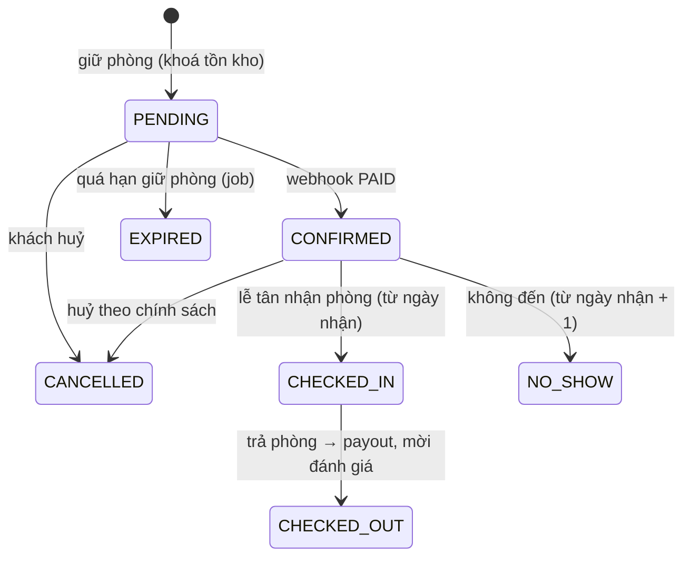

# State machine

```mermaid
stateDiagram-v2
  [*] --> PENDING: giữ phòng (khoá tồn kho)
  PENDING --> CONFIRMED: webhook PAID
  PENDING --> EXPIRED: quá hạn giữ phòng (job)
  PENDING --> CANCELLED: khách huỷ
  CONFIRMED --> CHECKED_IN: lễ tân nhận phòng (từ ngày nhận)
  CONFIRMED --> CANCELLED: huỷ theo chính sách
  CONFIRMED --> NO_SHOW: không đến (từ ngày nhận + 1)
  CHECKED_IN --> CHECKED_OUT: trả phòng → payout, mời đánh giá
```

Khách sạn: `PENDING_APPROVAL → ACTIVE | REJECTED`, `ACTIVE ↔ SUSPENDED`, `REJECTED` sửa hồ sơ → `PENDING_APPROVAL`. Thanh toán như Tour. Payout: `PENDING → PAID`.
